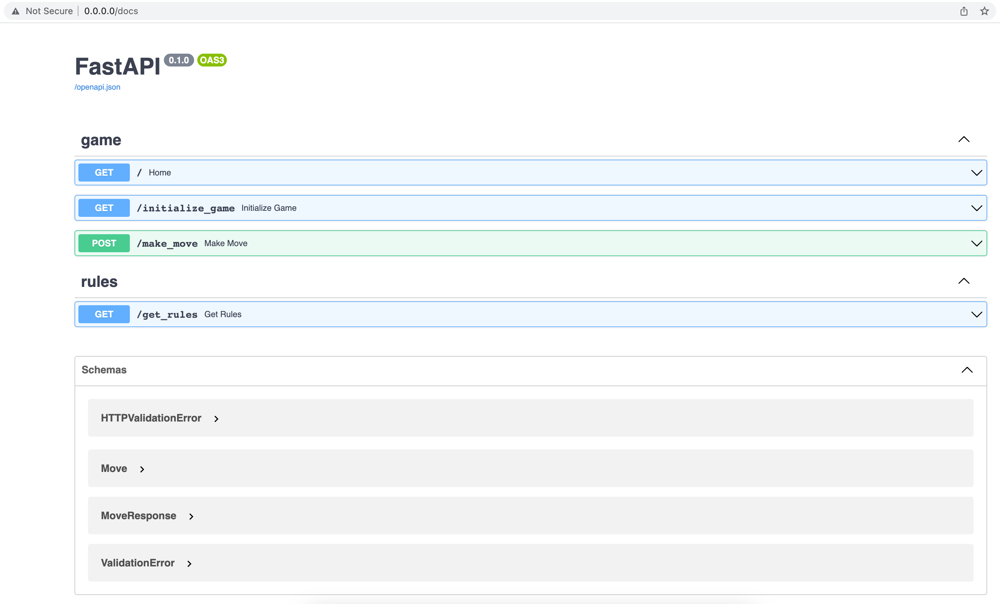
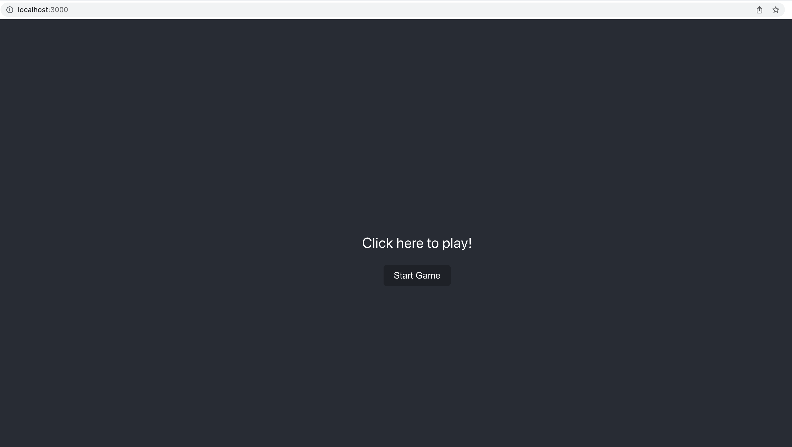
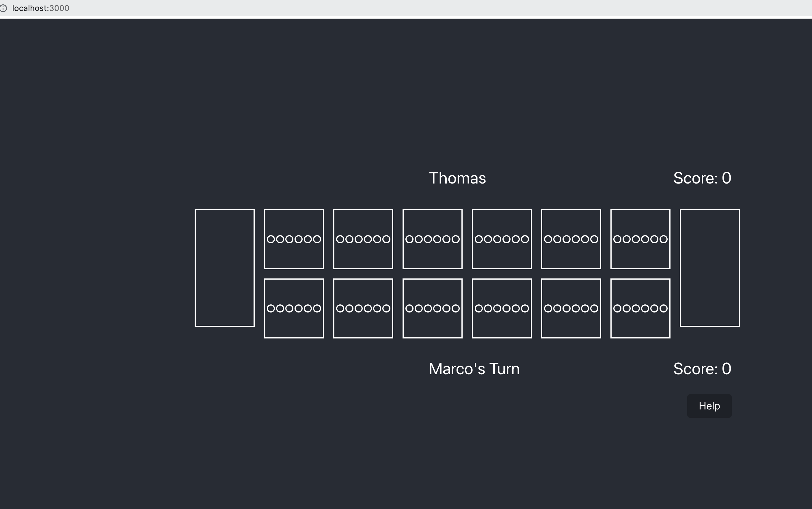
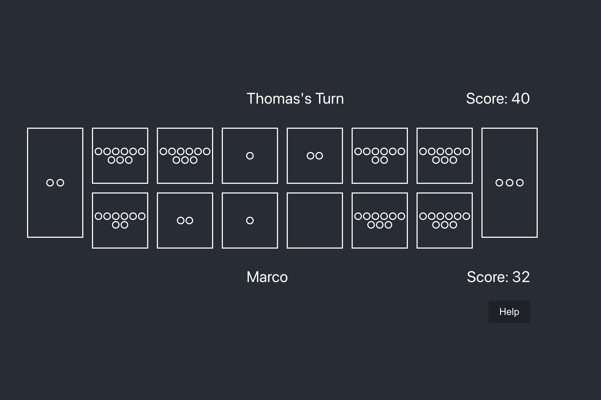
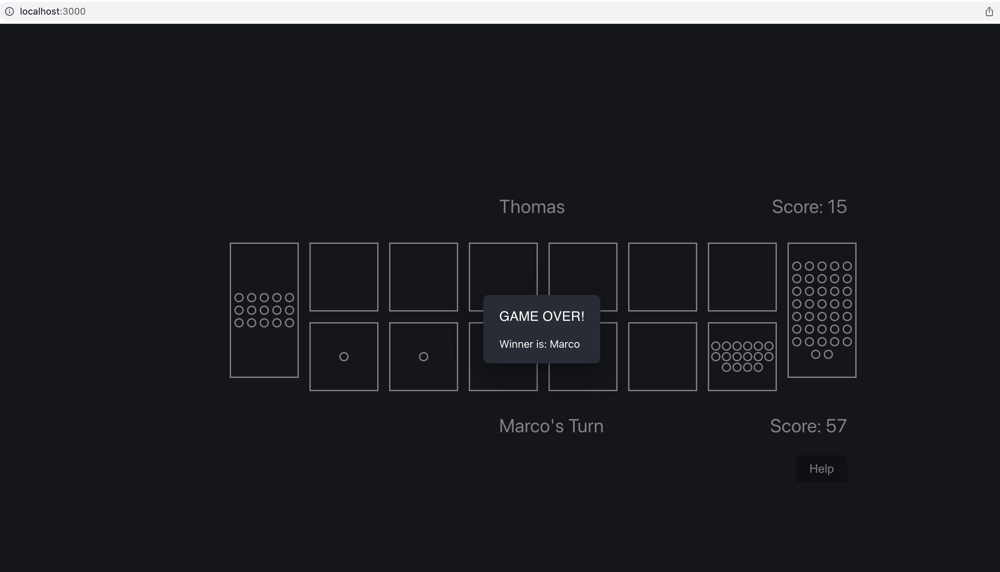
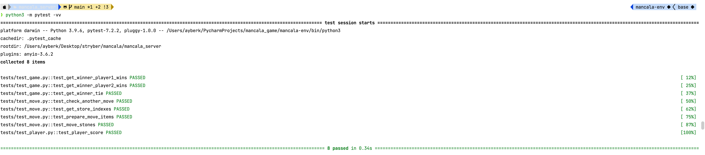

# Mancala Game

This project is a web-based implementation of the popular Mancala board game. The game is built using React on the client side and FastAPI on the server side.

## Getting Started
### Prerequisites
- [Python 3.9](https://www.python.org/downloads/)
- [npm](https://docs.npmjs.com/downloading-and-installing-node-js-and-npm)
- [Docker](https://docs.docker.com/get-docker/)

To get started with the Mancala game, follow the steps below:

1. Clone the repository to your local machine:
    
    ```
    git clone https://github.com/ayberktecimer/mancala.git
    ```
2. Navigate to the project directory:
    
    ```
    cd mancala
   ```
3. Run the Docker Compose command to start the game:
    ```
   docker compose up
   ```
This command will build and start the containers for the client and server sides of the game.
Please check `docker-compose.yml`, `mancala_client/Dockerfile`, and `mancala_server/Dockerfile` for more details.

4. Navigate to the client side of the game in your browser:
        ```
        http://localhost:3000
        ```
5. The server side of the game is exposed to:
        ```
            http://0.0.0.0:80
        ```
6. Server side auto documentation is available at:
        ```
            http://http://0.0.0.0:80/docs
        ```

## Game Play
1. Start a new game by clicking the `Start Game` button.

2. Click on a pit to make a move.

3. After several players moves, the game will be in mid game state.

4. The game will end when one of the players has no stones left in their pits.

## Running the Tests

### Prerequisites
- [Python 3.9](https://www.python.org/downloads/)
- [pip3](https://pip.pypa.io/en/stable/installation/)

To run the tests for the server side of the game, follow the steps below:

1. Navigate to the server directory:
    
    ```
    cd mancala_game_server
   ```
2. Create a virtual environment:
    
    ```
    python3 -m venv mancala_server_venv
   ```

3. Activate the virtual environment:
    
    ```
    source mancala_server_venv/bin/activate
   ```
4. Install the dependencies:
    
    ```
    pip3 install -r requirements.txt
   ```
5. Run the tests:
    
    ```
    python3 -m pytest -vv
   ```
6. Final result should look like:

## Project Directory Structure

```
mancala/
├── docs/
├── mancala_client/
│   ├── public/
│   └── src/
│       ├── components/
│       │   ├── AlertDialog/
│       │   ├── Pit/
│       │   └── Store/
│       └── services/
└── mancala_server/
    ├── exceptions/
    ├── game_engine/
    ├── models/
    │   ├── entity_models/
    │   └── rest_models/
    ├── routers/
    ├── static/
    └── tests/
```
- `docs` directory contains the images used in this README file.
- `mancala_client`: This directory contains the client-side code for the Mancala game. It contains the HTML, CSS, and JavaScript code that runs in the user's web browser.

  - `public`: This directory contains any static assets that the client code needs, such as images or fonts.
  - `src`: This directory contains the source code for the client-side of the game.
    - `components`: This directory contains the React components that make up the game.
      - `AlertDialog`: This directory contains the React component that renders the alert dialog that is shown when the game is over.
      - `Pit`: This directory contains the React component that renders the pits in the game.
      - `Store`: This directory contains the React component that renders the stores in the game.
    - `services`: This directory contains the JavaScript code that communicates with the server-side of the game.
- `mancala_server`: This directory contains the server-side code for the Mancala game. It handles the game logic, storage, and communication with clients.
  - `exceptions`: This directory contains the custom exceptions that are used in the game.
  - `game_engine`: This directory contains the game logic for the Mancala game.
  - `models`: This directory contains the models that are used in the game.
    - `entity_models`: This directory contains the models that are used to store the game state in the database.
    - `rest_models`: This directory contains the models that are used to communicate with the client-side of the game.
  - `routers`: This directory contains the routers that are used to handle the communication with the client-side of the game.
  - `static`: This directory contains the static files that are served by the server-side of the game.
  - `tests`: This directory contains the tests for the server-side of the game.

## Built With

* [React](https://reactjs.org/) - The client-side web framework used
* [FastAPI](https://fastapi.tiangolo.com/) - The server-side web framework used
* [Docker](https://www.docker.com/) - Containerization platform
* [Docker Compose](https://docs.docker.com/compose/) - Container orchestration tool


## LICENSE
This project is licensed under the MIT License - see the [LICENSE](LICENSE) file for details